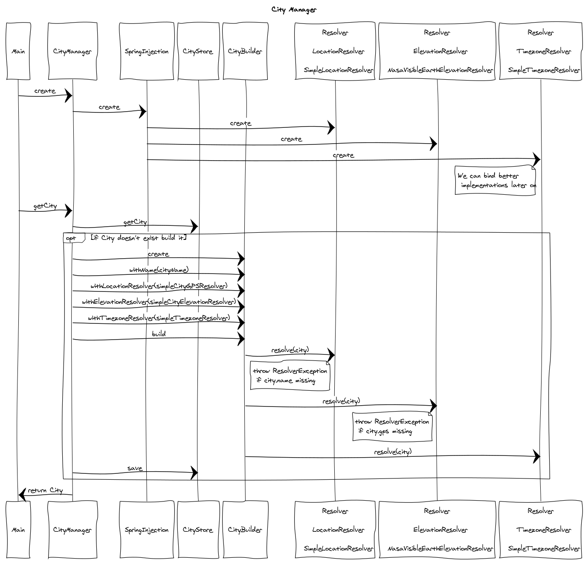
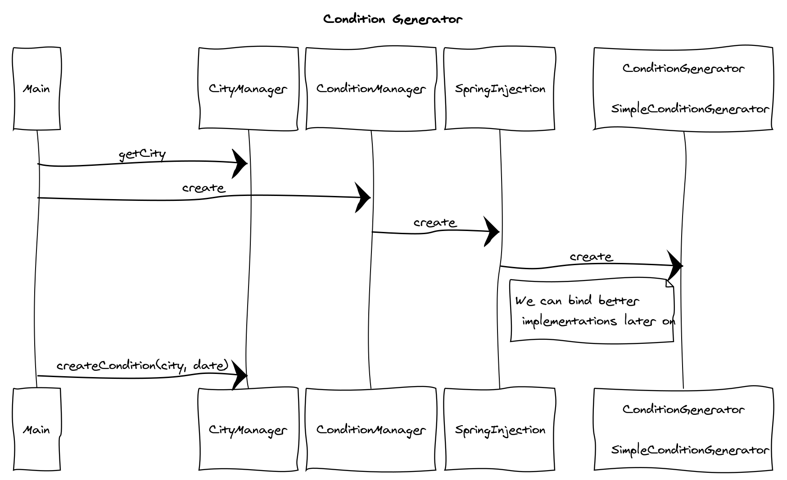

# Weather Machine

# Overview 

This application generates fake weather conditions for various cities and times 

# Dependencies 

You will need the following to run this application 
- Apache Maven 3 
- JDK 1.8 or higher 


# Running it

You can build, test and run the application with; 

`export MAVEN_OPTS=-Xmx500M; mvn clean install`

Maven will build and execute the main program with output like the following; 

```
 _______  __   __  _______    _     _  _______  _______  _______  __   __  _______  ______
 |       ||  | |  ||       |  | | _ | ||       ||   _   ||       ||  | |  ||       ||    _ |
 |_     _||  |_|  ||    ___|  | || || ||    ___||  |_|  ||_     _||  |_|  ||    ___||   | ||
   |   |  |       ||   |___   |       ||   |___ |       |  |   |  |       ||   |___ |   |_||_
   |   |  |       ||    ___|  |       ||    ___||       |  |   |  |       ||    ___||    __  |
   |   |  |   _   ||   |___   |   _   ||   |___ |   _   |  |   |  |   _   ||   |___ |   |  | |
   |___|  |__| |__||_______|  |__| |__||_______||__| |__|  |___|  |__| |__||_______||___|  |_|

 ==========================================  I S  ===========================================

Sydney|-33.87,151.21,35|2019-03-14T20:03:07.560+10:00|Rain|+19.2|353.8|67
Sydney|-33.87,151.21,35|2019-03-15T20:03:07.560+10:00|Rain|+9.3|460.6|84
Melbourne|-37.83,144.98,0|2019-03-14T21:03:10.981+11:00|Rain|+5.1|764.1|95
Adelaide|-34.92,138.62,69|2019-03-14T20:33:10.981+10:30|Sunny|+11.2|897.4|58
London|51.51,-0.13,0|2019-03-14T10:03:10.981Z|Sunny|+18.1|579.6|40

 ================================ H A V E  A  N I C E  D A Y  ===============================
```

# Design Considerations

The application has been designed to be modular, testable and plugable 
facilitating quick initial delivery of the end to end flow while clearly 
defining placeholders for enhancements at a later stage 

To enhance the application override one or all of the following and bind your implementation into the 
associated manager using the Spring autowiring annotation `@Qualifer`. 

- `LocationResolver` implementations find the location of a given city to it's latitude and longitude 
- `ElevationResolver` implementations find the elevation of a location by latitude and longitude 
- `TimezoneResolver` implementations find the timezone for a city or location 
- `ConditionGenerator` implementations generate weather conditions for a time and city

For now very simple implementations of the above have been added.

### Possible Idea for ConvolutionalConditionGenerator 

I have an idea for a `ConvolutionalConditionGenerator` which can achieve these these special requirements;
With the following outcomes to be acheived;
 1. Adjacent cities have similar weather 
 2. Gradual changes in weather are exhibited at any location
 3. Adjacent times have similar weather 
 4. Regional areas interesting behaviour 
 5. Seasonal changes are apparent 
 6. Year on year changes are apparent 

One solution is to apply multiple time incremented convolutional matrixes where each matrix implements one of the requirements 1 to 6 above. 

Why implement such a complex solution, well the changes could be gradually localized and additive per time step giving the perception of continuity which we experience in real life. For example if this weather program is used in a rally car driving game, the driver should not experience drastically different and sharp changes in weather when cruising at 150km/h between two cities. The driver should experience gradually changing weather over time.

There is a very interesting project at https://jaxenter.com/convolutional-lstm-deeplearning4j-146157.html encapsulating solutions for many of these ideas. 


## City Manager UML Sequence 




## Condition Manager UML Sequence 



